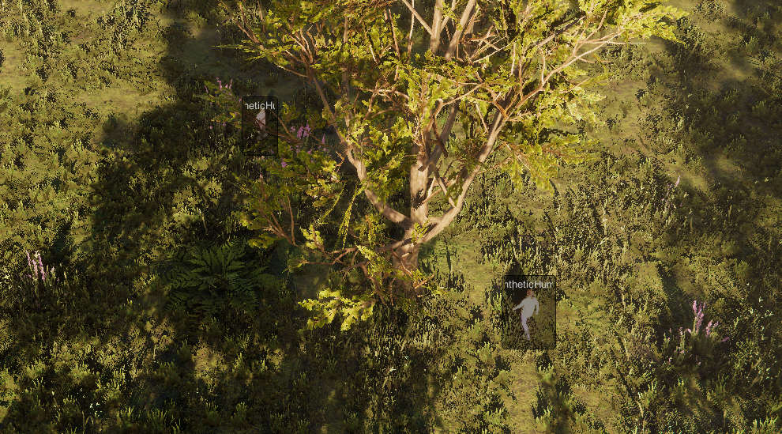

# Unity Synthetic World

A Unity World designed to produce Synthetic Datasets of people in different environments.

## Getting Started

This project, at its current state, produces a predefined amount of [synthetic humans](https://github.com/Unity-Technologies/com.unity.cv.synthetichumans.git) and organizes them in groups areas (Actor Areas). A waypoint generation is performed inside those areas and the generated humans are cycling through them avoiding obstacles and each-other. A labelling and annotating system is also impelemented, as well as a YOLO type dataset labelling generator.

 

### Prerequisites

This world is depended on the following unity packages: 
- [Unity Perception Package](https://github.com/Unity-Technologies/com.unity.perception.git)
- [Unity SyntheticHumans Package](https://github.com/Unity-Technologies/com.unity.cv.synthetichumans.git)
- [ROS-TCP-Connector](https://github.com/Unity-Technologies/ROS-TCP-Connector.git)

### ToDo List

- [x] Make everything start after the scenario finalization.
- [x] Fix "Waiting" upon a human reaches its waypoint.
- [x] Update y coord (height) at actor spawn.
- [x] Fix Dataset File save (.txt & .png).
- [x] Implement terrain type awareness (make actors do not walk in the water).
- [x] Generate Waypoint Inside the boundaries of "ActorArea" GameObject.
- [x] Implement coordinates transformation for waypoint generation.
